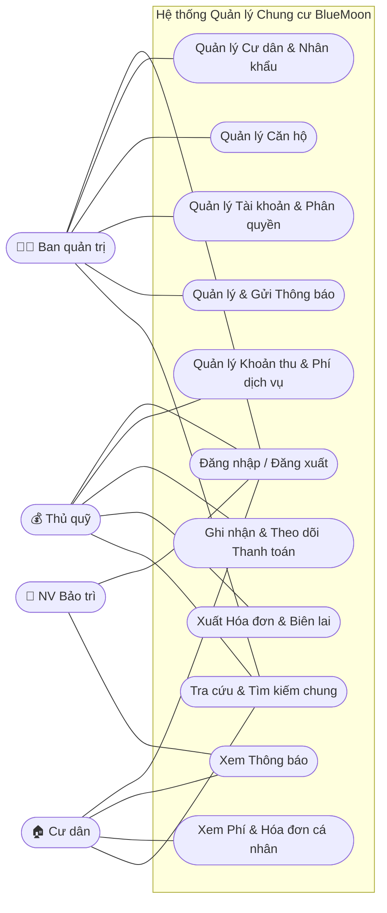

# Sơ đồ Use Case - Dự án Quản lý Chung cư BlueMoon

Dựa trên tài liệu `README.md` của dự án, hệ thống quản lý chung cư BlueMoon có **4 đối tượng người dùng (Actor)** chính:
1. **Ban quản trị (Admin):** Quản lý cư dân, căn hộ, người dùng và gửi thông báo.
2. **Thủ quỹ (Cashier):** Quản lý các khoản thu, phí dịch vụ, ghi nhận thanh toán và xuất hóa đơn.
3. **Cư dân (Resident):** Xem thông báo, tra cứu phí và hóa đơn cá nhân.
4. **Nhân viên bảo trì (Maintenance):** Xem các thông báo (như điều phối công việc).

Dưới đây là sơ đồ Use Case tổng quan của hệ thống:

## Phân tích chi tiết các Use Case (Chức năng)

### 1. Nhóm chức năng chung (Tất cả người dùng)
- **Đăng nhập / Đăng xuất:** Người dùng cần xác thực qua hệ thống (sử dụng JWT) để vào các chức năng tương ứng với quyền của mình.
- **Tra cứu & Tìm kiếm chung:** Tìm kiếm thông tin cơ bản về căn hộ, tên cư dân (tùy theo quyền hạn).

### 2. Ban quản trị (Admin)
- **Quản lý Cư dân & Nhân khẩu:** Thêm mới, chỉnh sửa, xóa và lưu trữ thông tin của cư dân, hộ gia đình.
- **Quản lý Căn hộ:** Cập nhật thông tin các căn hộ (diện tích, trạng thái, người ở).
- **Quản lý Tài khoản & Phân quyền:** Quản lý danh sách tài khoản hệ thống và cấp quyền (Ban quản trị, Thủ quỹ, Cư dân, Bảo trì).
- **Quản lý & Gửi Thông báo:** Tạo và gửi thông báo đến một nhóm hoặc tất cả cư dân, nhân viên.

### 3. Thủ quỹ (Cashier)
- **Quản lý Khoản thu & Phí dịch vụ:** Thiết lập các loại phí (phí bắt buộc, tự nguyện) và tự động tính phí theo diện tích.
- **Ghi nhận & Theo dõi Thanh toán:** Cập nhật trạng thái đóng phí của từng hộ gia đình.
- **Xuất Hóa đơn & Biên lai:** Tạo và xuất hóa đơn thanh toán cho cư dân sau khi đóng phí.

### 4. Cư dân (Resident)
- **Xem Thông báo:** Nhận và đọc các thông báo từ Ban quản trị.
- **Xem Phí & Hóa đơn cá nhân:** Tra cứu thông tin các khoản phí mà gia đình mình cần đóng hoặc đã đóng, xem biên lai điện tử.

### 5. Nhân viên bảo trì (Maintenance)
- **Xem Thông báo:** Nhận các thông báo từ hệ thống (có thể là thông báo sửa chữa, điều phối công việc cơ bản).
